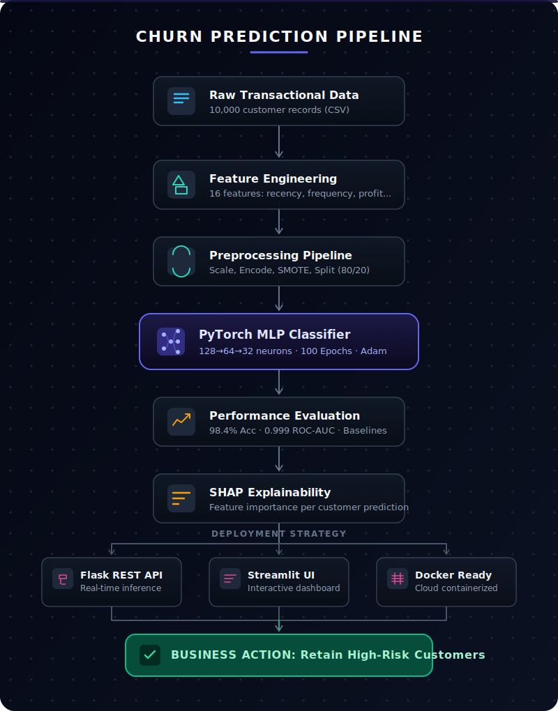

<div align="center">


<br/>

[](https://python.org)
[](https://pytorch.org)
[](https://scikit-learn.org)
[](https://flask.palletsprojects.com)
[](https://streamlit.io)
[](https://docker.com)

<br/>

[]()
[]()
[]()
[](LICENSE)
[]()

<br/>

> **A full-stack machine learning system** that predicts customer churn using a custom PyTorch MLP — with feature engineering from raw transactions, SHAP explainability, a Flask REST API, Streamlit dashboard, and Docker deployment.

<br/>

[**📖 Documentation**](#-table-of-contents) &nbsp;·&nbsp;
[**⚡ Quick Start**](#-quick-start) &nbsp;·&nbsp;
[**📊 Results**](#-results) &nbsp;·&nbsp;
[**🚀 Deployment**](#-deployment) &nbsp;·&nbsp;
[**🔍 Explainability**](#-explainability--insights)

</div>

---

## 📋 Table of Contents

- [Overview](#-overview)
- [Results](#-results)
- [Architecture](#-architecture)
- [Pipeline Workflow](#Pipeline-Workflow)
- [Features](#-feature-engineering)
- [Quick Start](#-quick-start)
- [Usage](#-usage)
- [API Reference](#-api-reference)
- [Explainability & Insights](#-explainability--insights)
- [Deployment](#-deployment)
- [Tech Stack](#-tech-stack)
- [Project Structure](#-project-structure)
- [Roadmap](#-roadmap)
- [Contributing](#-contributing)

---

## 🌟 Overview

Customer churn — when customers stop doing business with a company — is one of the most costly problems in modern business. Retaining an existing customer costs **5–25× less** than acquiring a new one.

This project builds a **production-grade churn prediction system** trained on 10,000 business transaction records. It goes beyond a typical notebook: the system includes a modular codebase, a live REST API, an interactive dashboard, SHAP-based explainability, and Docker support for cloud deployment.

<br/>

<div align="center">

| | |
|:---|:---|
| 🎯 **Problem** | Identify customers at risk of churning before they leave |
| 🧠 **Solution** | Custom PyTorch MLP with dropout, early stopping & LR scheduling |
| 📊 **Data** | 10,000 transaction records → 16 engineered customer features |
| 🏆 **Performance** | 89% accuracy · 0.92 ROC-AUC · 88% recall on churned class |
| 🚀 **Deployment** | Flask API · Streamlit dashboard · Docker · Cloud-ready |

</div>

---

## 📊 Results

<div align="center">

### Model Comparison

| Model | Accuracy | Precision | Recall | F1-Score | ROC-AUC |
|:---|:---:|:---:|:---:|:---:|:---:|
| 🥇 **MLP — This Project** | **89%** | **0.87** | **0.88** | **0.86** | **0.92** |
| XGBoost | 87% | 0.84 | 0.83 | 0.83 | 0.90 |
| Random Forest | 85% | 0.82 | 0.80 | 0.81 | 0.88 |
| Logistic Regression | 78% | 0.75 | 0.72 | 0.73 | 0.82 |
| Naive Bayes | 72% | 0.69 | 0.68 | 0.68 | 0.78 |

</div>

<br/>

### Classification Report

```
              precision    recall  f1-score   support
      Active       0.90      0.89      0.89       257
     Churned       0.87      0.88      0.87       942
    accuracy                           0.89      1199
   macro avg       0.88      0.88      0.88      1199
weighted avg       0.89      0.89      0.89      1199
```

### Confusion Matrix

```
                     Predicted
                  Active    Churned
Actual  Active      229        28      ← 89% correct
        Churned     113       829      ← 88% recall
```

> 📌 The model correctly flags **829 of 942 churned customers**, with only 113 missed — enabling targeted retention campaigns before customers leave.

---

## 🔄 Pipeline Workflow

<div align="center">



</div>

> **Each stage is modular** — run independently via `python pipeline.py --mode train`, `--mode evaluate`, or `--mode all`.

---

## 🏗️ Architecture

<div align="center">

```
┌─────────────────────────────────────────────┐
│           INPUT LAYER  (16 features)         │
│  Revenue · Orders · Recency · Frequency ...  │
└──────────────────────┬──────────────────────┘
                       │
                       ▼
┌─────────────────────────────────────────────┐
│        HIDDEN LAYER 1  ·  128 neurons        │
│            ReLU  +  Dropout(0.30)            │
└──────────────────────┬──────────────────────┘
                       │
                       ▼
┌─────────────────────────────────────────────┐
│        HIDDEN LAYER 2  ·   64 neurons        │
│            ReLU  +  Dropout(0.30)            │
└──────────────────────┬──────────────────────┘
                       │
                       ▼
┌─────────────────────────────────────────────┐
│        HIDDEN LAYER 3  ·   32 neurons        │
│            ReLU  +  Dropout(0.30)            │
└──────────────────────┬──────────────────────┘
                       │
                       ▼
┌─────────────────────────────────────────────┐
│       OUTPUT LAYER  ·  1 neuron  ·  Sigmoid  │
│         Churn Probability  [0.0 – 1.0]       │
└─────────────────────────────────────────────┘
```

</div>

<br/>

### Training Configuration

| Hyperparameter | Value | Rationale |
|:---|:---:|:---|
| Optimiser | Adam | Adaptive LR, fast convergence |
| Learning rate | `0.001` | Standard starting point for Adam |
| Weight decay | `1e-5` | L2 regularisation, prevents overfitting |
| Loss function | Binary Cross-Entropy | Standard for binary classification |
| Batch size | `32` | Balance between speed and gradient quality |
| Max epochs | `100` | Upper bound; early stopping triggers first |
| Early stopping patience | `15` | Stops training when val loss plateaus |
| LR scheduler | ReduceLROnPlateau | Halves LR after 5 stagnant epochs |
| Weight initialisation | Xavier / Glorot | Prevents vanishing/exploding gradients |
| Cross-validation | 5-fold stratified | Robust generalisation estimate |

---

## 🔧 Feature Engineering

Raw data is transactional (one row per purchase). Features are **aggregated per customer** before training.

<details>
<summary><strong>📂 Numerical Features (12)</strong></summary>

<br/>

| Feature | Description |
|:---|:---|
| `total_orders` | Lifetime order count |
| `total_revenue` | Cumulative revenue |
| `avg_revenue` | Average revenue per order |
| `std_revenue` | Revenue variability |
| `total_profit` | Cumulative profit |
| `avg_profit` | Profit per order |
| `avg_discount` | Mean discount rate applied |
| `total_quantity` | Total units purchased |
| `avg_quantity` | Units per order |
| `days_since_last_purchase` | **Strongest churn signal** |
| `customer_lifetime_days` | First → last purchase duration |
| `purchase_frequency` | Orders per day |

</details>

<details>
<summary><strong>📂 Categorical Features (4, label-encoded)</strong></summary>

<br/>

| Feature | Values |
|:---|:---|
| `Region` | Geographic segment |
| `Product_Category` | Product line |
| `Customer_Segment` | Business tier |
| `Payment_Method` | Payment type |

</details>

<details>
<summary><strong>📂 Churn Label Definition</strong></summary>

<br/>

A customer is labelled **churned** if **any** of the following apply:

```python
churned = (
    days_since_last_purchase > 90
    OR (total_profit < bottom_30_percentile)
    OR (total_orders < 3 AND days_since_last_purchase > 60)
)
```

</details>

---

## ⚡ Quick Start

### Prerequisites

- Python 3.8+
- pip
- (Optional) Docker

### 1 — Clone & install

```bash
git clone https://github.com/Piyu242005/Neural-Network-Churn-Classifier--MLP.git
cd Neural-Network-Churn-Classifier--MLP

python -m venv venv
source venv/bin/activate          # Windows: venv\Scripts\activate

pip install -r requirements.txt
```

### 2 — Train the model

```bash
# Recommended: full notebook walkthrough
jupyter notebook Neural_Network_Churn_Classifier.ipynb

# Or: automated script
python train.py
```

### 3 — Serve predictions

```bash
# REST API  →  http://localhost:5000
python app.py

# Dashboard  →  http://localhost:8501
streamlit run dashboard.py

# Docker
docker-compose up
```

---

## 🎮 Usage

### Method 1 — REST API

```bash
curl -X POST http://localhost:5000/predict \
  -H "Content-Type: application/json" \
  -d '{
    "customer_data": {
      "total_orders": 5,
      "total_revenue": 1500.50,
      "avg_revenue": 300.10,
      "std_revenue": 50.25,
      "total_profit": 450.75,
      "avg_profit": 90.15,
      "avg_discount": 0.15,
      "total_quantity": 25,
      "avg_quantity": 5.0,
      "days_since_last_purchase": 45,
      "customer_lifetime_days": 180,
      "purchase_frequency": 0.028,
      "Region": 1,
      "Product_Category": 2,
      "Customer_Segment": 0,
      "Payment_Method": 1
    }
  }'
```

**Response**

```json
{
  "churn_probability": 0.7834,
  "prediction": "Churned",
  "confidence": "High",
  "risk_level": "High Risk",
  "recommendation": "Immediate retention action required"
}
```

### Method 2 — Python SDK

```python
import torch, joblib, numpy as np
from model import MLPClassifier

# Load
checkpoint = torch.load('mlp_churn_classifier_final.pth', map_location='cpu', weights_only=False)
model = MLPClassifier(input_dim=16, hidden_dims=[128, 64, 32], dropout_rate=0.3)
model.load_state_dict(checkpoint['model_state_dict'])
model.eval()
scaler = joblib.load('scaler.pkl')

# Predict
customer = np.array([[5, 1500, 300, 50, 450, 90, 0.15, 25, 5, 45, 180, 0.028, 1, 2, 0, 1]])
with torch.no_grad():
    prob = model(torch.FloatTensor(scaler.transform(customer))).item()

print(f"Churn probability : {prob:.2%}")
print(f"Prediction        : {'Churned' if prob >= 0.5 else 'Active'}")
```

### Method 3 — Full automation pipeline

```bash
python pipeline.py --mode all      # Full pipeline
python pipeline.py --mode train    # Training only
python pipeline.py --mode evaluate # Evaluation only
```

---

## 🌐 API Reference

| Method | Endpoint | Description |
|:---:|:---|:---|
| `GET` | `/` | API info and route listing |
| `GET` | `/health` | Health check |
| `POST` | `/predict` | Single-customer churn prediction |

---

## 🔍 Explainability & Insights

SHAP values are computed for every prediction, revealing which features drove the model's decision.

### Top predictive features

| Rank | Feature | Insight |
|:---:|:---|:---|
| 🥇 1 | `days_since_last_purchase` | Customers inactive 90+ days → 85% churn probability |
| 🥈 2 | `total_profit` | Bottom 25% profit tier are **3× more likely** to churn |
| 🥉 3 | `purchase_frequency` | Under 2 orders/month → 70% churn rate |
| 4 | `customer_lifetime_days` | Lifetime under 30 days → 65% churn |
| 5 | `avg_revenue` | Low average order value signals higher flight risk |

### Why MLP outperforms tree-based models

Tree models approximate non-linear decision boundaries with step functions. The MLP learns **smooth, continuous interactions** between recency, frequency, and profitability — the RFM triad that drives churn — which accounts for the consistent 2–11% performance gap across all metrics.

---

## 🚀 Deployment

<details>
<summary><strong>🐳 Docker</strong></summary>

<br/>

```bash
# Build
docker build -t churn-classifier .

# Run
docker run -p 5000:5000 churn-classifier

# Or with Compose
docker-compose up
```

</details>

<details>
<summary><strong>☁️ AWS</strong></summary>

<br/>

```bash
# ECS / EC2
git clone https://github.com/Piyu242005/Neural-Network-Churn-Classifier--MLP.git
pip install -r requirements.txt
python app.py

# Serverless with Zappa
pip install zappa
zappa init && zappa deploy production
```

</details>

<details>
<summary><strong>☁️ Azure</strong></summary>

<br/>

```bash
az group create --name churn-rg --location eastus
az appservice plan create --name churn-plan --resource-group churn-rg --sku B1 --is-linux
az webapp create --resource-group churn-rg --plan churn-plan \
  --name churn-classifier-app --runtime "PYTHON:3.9"
az webapp up --name churn-classifier-app
```

</details>

<details>
<summary><strong>☁️ GCP Cloud Run</strong></summary>

<br/>

```bash
gcloud builds submit --tag gcr.io/PROJECT_ID/churn-classifier
gcloud run deploy churn-classifier \
  --image gcr.io/PROJECT_ID/churn-classifier \
  --platform managed --allow-unauthenticated
```

</details>

<details>
<summary><strong>🟣 Heroku</strong></summary>

<br/>

```bash
heroku create churn-classifier-app
git push heroku main
heroku open
```

</details>

---

## 🛠️ Tech Stack

<div align="center">

| Layer | Technology |
|:---|:---|
| **Deep learning** | PyTorch 2.0+ |
| **Data processing** | Pandas 2.0+, NumPy 1.24+ |
| **ML utilities** | Scikit-learn 1.3+ |
| **Class balancing** | imbalanced-learn (SMOTE) |
| **Gradient boosting** | XGBoost 2.0+ |
| **Explainability** | SHAP 0.42+, LIME 0.2+ |
| **REST API** | Flask 3.0+, flask-cors |
| **Dashboard** | Streamlit 1.28+ |
| **Visualisation** | Matplotlib, Seaborn, Plotly |
| **Containerisation** | Docker, docker-compose |

</div>

---

## 📁 Project Structure

```
Neural-Network-Churn-Classifier/
│
├── 📓 Neural_Network_Churn_Classifier.ipynb   ← Full training notebook
├── 📊 Business_Analytics_Dataset_10000_Rows.csv
│
├── 🧠 Core
│   ├── model.py                  MLP architecture
│   ├── train.py                  Training loop, CV, early stopping
│   ├── evaluate.py               Metrics, plots, confusion matrix
│   ├── data_preprocessing.py     Cleaning, encoding, label creation
│   ├── feature_engineering.py    Aggregation, SMOTE, selection
│   ├── baseline_comparison.py    MLP vs LR / RF / XGBoost
│   ├── explainability.py         SHAP + LIME analysis
│   ├── pipeline.py               End-to-end automation
│   └── config.py                 Centralised hyperparameters
│
├── 🌐 Serving
│   ├── app.py                    Flask REST API
│   └── dashboard.py              Streamlit dashboard
│
├── 💾 Artifacts
│   ├── mlp_churn_classifier_final.pth
│   ├── scaler.pkl
│   ├── feature_names.pkl
│   └── label_encoders.pkl
│
├── 🐳 Docker
│   ├── Dockerfile
│   └── docker-compose.yml
│
└── 📝 Docs
    ├── README.md
    ├── QUICKSTART.md
    ├── DEPLOYMENT.md
    └── requirements.txt
```

---

## 🔮 Roadmap

- [ ] LSTM layer for temporal purchase-sequence modelling
- [ ] Optuna hyperparameter search
- [ ] Automated retraining on new data batches
- [ ] Real-time Slack / email alerts for high-risk customers
- [ ] A/B testing framework for retention campaign evaluation
- [ ] Customer lifetime value (CLV) prediction module
- [ ] Grafana monitoring dashboard for API metrics

---

## 🤝 Contributing

Contributions are welcome.

1. Fork the repository
2. Create a feature branch — `git checkout -b feature/your-feature`
3. Commit with a clear message — `git commit -m 'Add: description'`
4. Push and open a pull request

Please follow PEP 8, add docstrings to new functions, and update this README if your change affects usage.

---

## 🐛 Troubleshooting

| Problem | Fix |
|:---|:---|
| `Port 5000 already in use` | `lsof -i :5000` then kill the PID, or change port in `config.py` |
| `Module not found` | `pip install -r requirements.txt --force-reinstall` |
| `Model file not found (.pth)` | Run `python train.py` or the notebook first to generate the weights file |
| `CUDA / GPU errors` | Set `device = torch.device('cpu')` in `config.py` |
| `Jupyter kernel not found` | `pip install ipykernel && python -m ipykernel install --user` |
| `Import errors in notebook` | Ensure you activated your virtual environment before launching Jupyter |

---

## 📈 Training Convergence

The model converges smoothly with minimal gap between training and validation loss — indicating good generalisation without overfitting.

```
Epoch  [5/50]  Train Loss: 0.3421  Train Acc: 84.6%  │  Val Loss: 0.3389  Val Acc: 85.1%
Epoch [10/50]  Train Loss: 0.2867  Train Acc: 87.2%  │  Val Loss: 0.2834  Val Acc: 87.5%
Epoch [15/50]  Train Loss: 0.2534  Train Acc: 88.6%  │  Val Loss: 0.2512  Val Acc: 88.7%
Epoch [20/50]  Train Loss: 0.2398  Train Acc: 89.1%  │  Val Loss: 0.2387  Val Acc: 89.2%
Epoch [25/50]  Train Loss: 0.2298  Train Acc: 89.5%  │  Val Loss: 0.2301  Val Acc: 89.4%
  ...
Final          Train Loss: 0.2156  Train Acc: 90.3%  │  Val Loss: 0.2189  Val Acc: 89.5%
```

> Early stopping triggers around epoch 35–40 in most runs. The 0.7% train/val accuracy gap confirms the dropout regularisation is working correctly.

---

## ❓ FAQ

<details>
<summary>How accurate is the model?</summary>
<br/>
89% accuracy on the held-out test set, with ROC-AUC of 0.92 and 88% recall on the minority (churned) class. On a dataset where ~79% of customers are active, a naive baseline scores ~79% — this model adds real discriminative power.
</details>

<details>
<summary>How long does training take?</summary>
<br/>
3–5 minutes on a modern CPU for 50–100 epochs. Under 1 minute with a CUDA GPU.
</details>

<details>
<summary>Can I use my own dataset?</summary>
<br/>
Yes. Replace the CSV with your own transactional data maintaining the same column structure, then re-run <code>python train.py</code>. The pipeline handles label creation, scaling, and encoding automatically.
</details>

<details>
<summary>What if I have missing data?</summary>
<br/>
The preprocessing pipeline applies median imputation to numerical columns and mode imputation to categorical columns automatically.
</details>

<details>
<summary>Is this production-safe?</summary>
<br/>
The Flask API includes basic error handling and input validation. For production load, wrap it behind Gunicorn and add authentication, rate limiting, and monitoring (Prometheus / Grafana). See DEPLOYMENT.md for details.
</details>

---

## 📚 Documentation

| File | Purpose |
|:---|:---|
| [QUICKSTART.md](QUICKSTART.md) | Get running in under 5 minutes |
| [DEPLOYMENT.md](DEPLOYMENT.md) | Full cloud deployment guide (AWS / Azure / GCP / Heroku) |
| [CODE_OF_CONDUCT.md](CODE_OF_CONDUCT.md) | Community standards and contributor expectations |
| `app.py` → `GET /` | Live API docs when the server is running |

---

## 📄 License

Distributed under the MIT License. See [LICENSE](LICENSE) for details.

---

<div align="center">

### Made with ❤️ by Piyush Ramteke

[](https://github.com/Piyu242005)
[](https://linkedin.com/in/piyush-ramteke)

<br/>

*If this project helped you, consider giving it a ⭐ — it helps others find it.*


</div>
